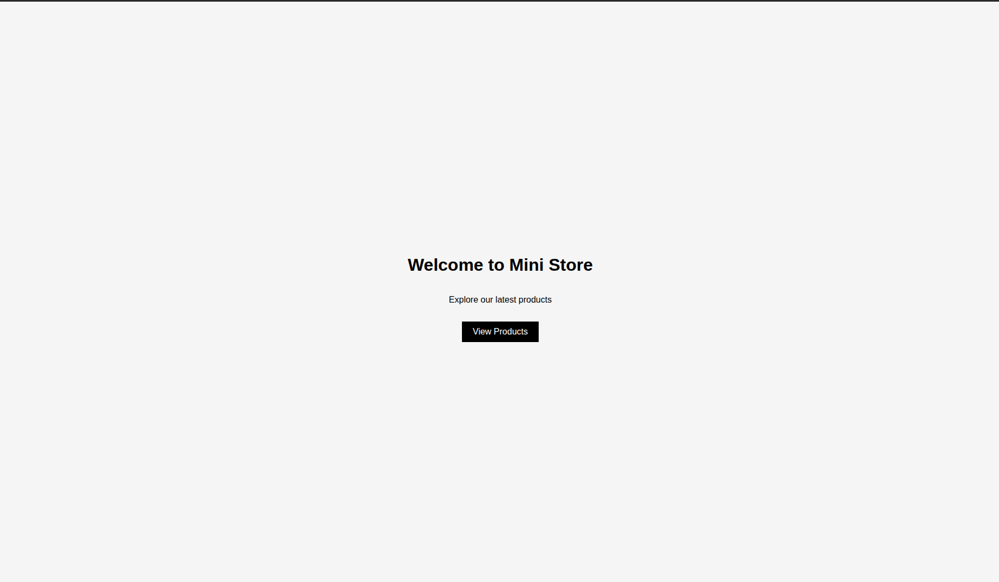
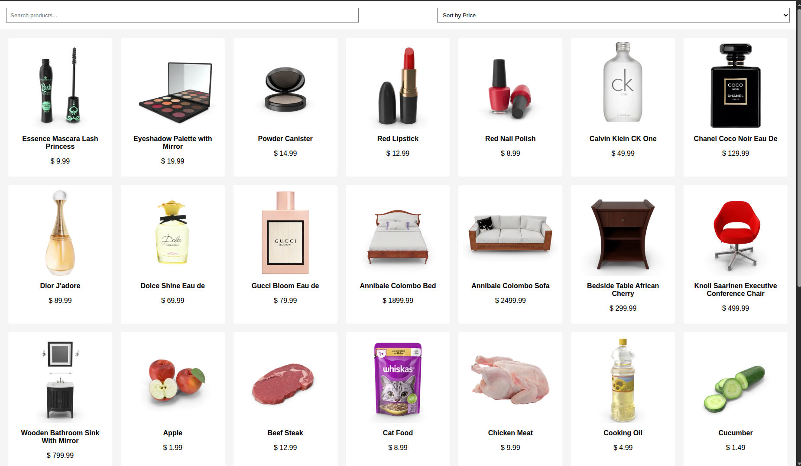

# Mini E-commerce Product Listing Page

This project is created as part of **Week 2 – Day 5 (Frontend Capstone Project)**.  
The main goal of this task was to combine **HTML, CSS, and JavaScript** and build a small but functional UI.

---

## About the Project

I built a mini e-commerce product listing page where products are fetched from an API and displayed dynamically.  
Users can search for products and sort them by price.

This project helped me understand how frontend concepts work together in a real-world scenario.

---

## Features

- Products fetched using **Fetch API**
- Product cards with image, title, and price
- Search functionality to filter products
- Sort products by price (High → Low, Low → High)
- Responsive layout for different screen sizes

---

## Screenshots

### Screenshot 1 – Product Listing Page

### Screenshot 2 – Search and Sort in Action

---

## What I Learned

- How to fetch data from an API using JavaScript
- How to render UI dynamically using DOM manipulation
- How search and sort logic works in JavaScript
- How to build a responsive layout using CSS Grid
- How to combine HTML, CSS, and JS into one working project

---

## Final Note

This project improved my confidence in frontend development and helped me understand how small features come together to form a complete user interface.
