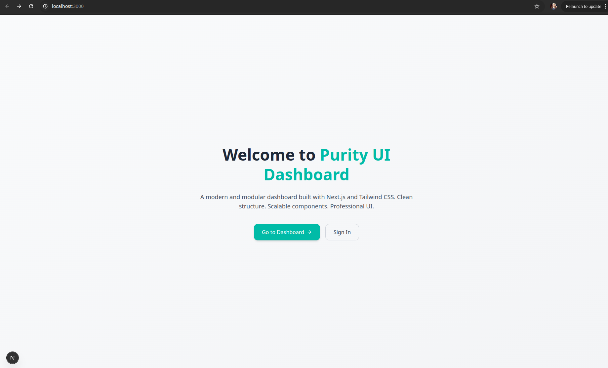
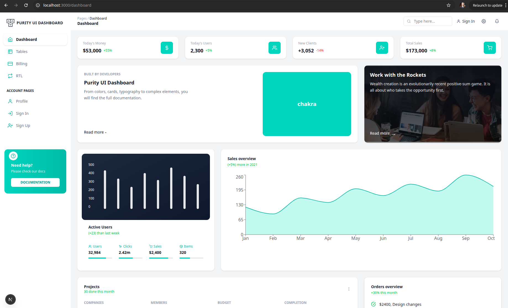
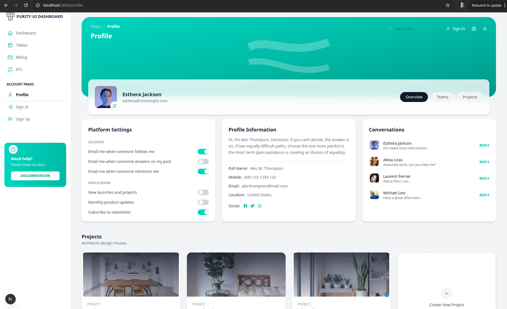
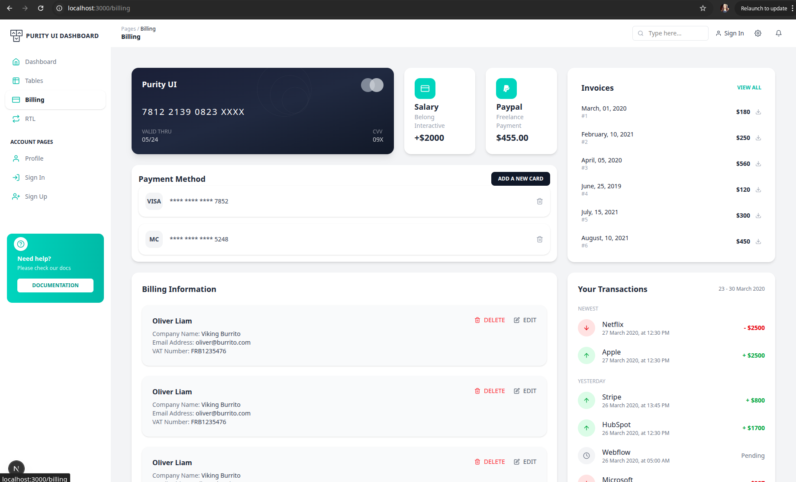
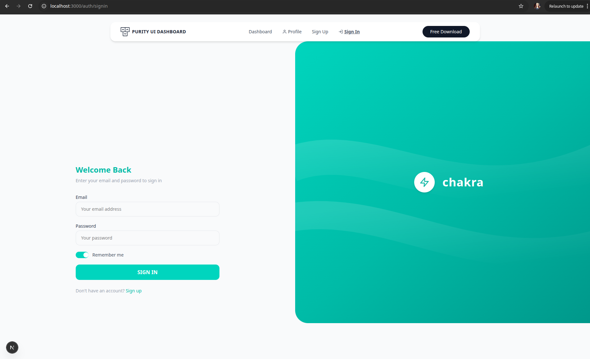
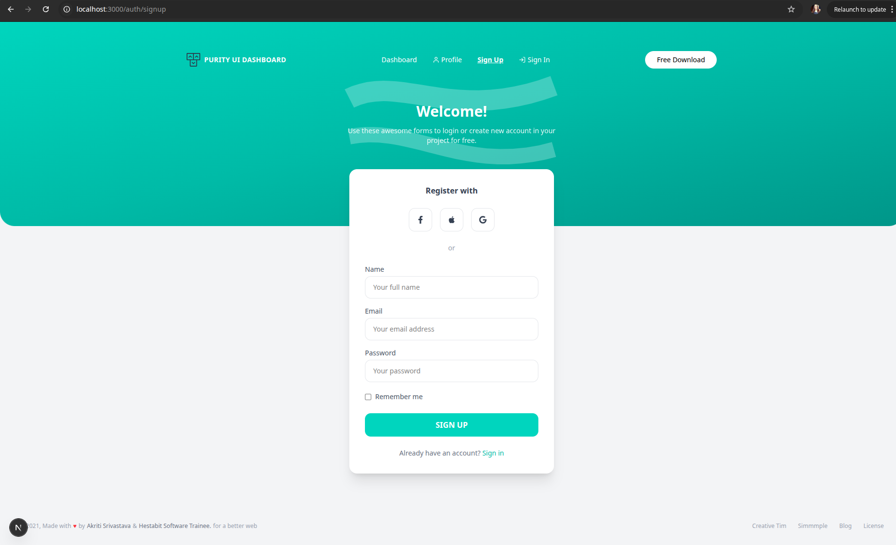
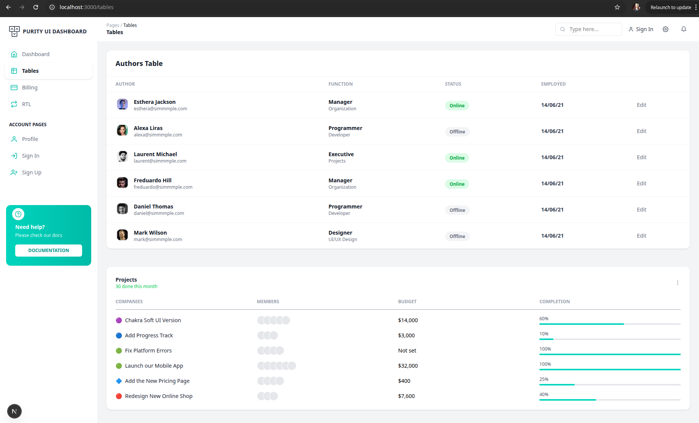

#  Week 3 – Purity UI Dashboard (Next.js + Tailwind)

This project is a modern dashboard UI built using **Next.js (App Router)** and **Tailwind CSS**.  
The goal was to create a clean, modular, and scalable frontend structure with multiple pages.

---

##  Screenshots

###  Landing Page


###  Dashboard


###  Profile


###  Billing


###  Sign In


###  Sign Up


###  Tables


---

##  Folder Structure

```
app/
 ├── layout.js
 ├── page.js
 ├── dashboard/
 ├── profile/
 ├── billing/
 ├── tables/
 └── (auth)/
      └── auth/
           ├── signin/
           └── signup/

components/
 ├── ui/
 ├── auth/
 ├── dashboard/
 ├── profile/
 ├── billing/
```

---

## 🧩 Components List

### 🔹 UI Components
- Sidebar
- Navbar
- Footer

### 🔹 Auth Components
- AuthNavbar
- SignInForm
- SignUpForm
- AuthRightPanel
- AuthFooter

### 🔹 Dashboard Components
- StatCard
- StatsGrid
- ActiveUsersCard
- SalesOverviewCard

### 🔹 Profile Components
- ProfileHero
- ProfileHeaderCard
- PlatformSettingsCard
- ProfileInformationCard
- ConversationsCard
- ProjectsSection

### 🔹 Billing Components
- CreditCard
- SalaryCard
- PaypalCard
- InvoicesCard
- PaymentMethodSection
- BillingInformationSection
- TransactionsSection

---

## Lessons Learned

- Understanding **Next.js App Router**
- Difference between **Server and Client Components**
- When to use `"use client"`
- Creating **modular and reusable components**
- Managing **layouts for different pages**
- Using **Tailwind CSS for fast UI development**
- Handling **real-world UI alignment issues**
- Debugging **workspace and dependency errors**

---

## 🛠 Tech Stack

- Next.js (App Router)
- React
- Tailwind CSS
- React Icons
- Recharts

---

## ▶ How to Run

```bash
npm install
npm run dev
```

Open: http://localhost:3000

---
